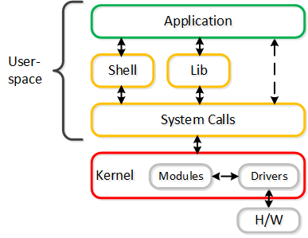

Hello there! I recently became fascinated by the world of monitoring, which eventually led me to discover eBPF.
As I started digging into eBPF, I found it super cool and got hooked. It made me want to explore the inner workings of the kernel.
With this newfound enthusiasm, I'm excited to announce the launch of my own blog series where I'll share my experiences and insights about eBPF and kernel as I learn along the way.

## The Linux Kernel

To understand eBPF, you will need to understand what is kernel, what is user space and what is system call.

The Linux kernel is the software layer that acts as an intermediary between applications and the underlying hardware on which they operate. Our applications run in an unprivileged layer known as 'user space', and they lack direct access to hardware. Instead, applications communicate with the hardware through a system call interface, where they request the kernel to facilitate interactions with the hardware on their behalf. This is illustrated as -

## What is eBPF ?

Extended Berkeley Packet Filter (eBPF) is a Linux kernel feature that makes it possible to run sandboxed programs inside the kernel space in a safe and controlled manner, allowing us to modify and extend the kernel without having to alter and re-compiling the kernel’s source code. Don't judge it by name, it is not just a packet filter anymore.

It was introduced in the Linux kernel version 3.15 in 2014. It was originally developed as an extension of the Berkeley Packet Filter (BPF) to allow for more complex and dynamic filtering of network packets. Since then, eBPF has evolved to become a powerful and flexible tool for tracing, profiling, security analysis etc.

> In Brendan Gregg’s own words: “eBPF does to Linux what JavaScript does to HTML." 

One of eBPF's most notable aspects is the eBPF verifier, a component that enhances the safety of kernel execution. Allow me to clarify what 'safer' means in this context.

In the past, if you needed a specific feature in the kernel, the process involved making a request within the kernel community. Even if you embarked on the development journey, there was no guarantee that your changes would be accepted. Moreover, releasing these kernel modifications and having them integrated into the OS your organization uses is a time-consuming process which can few months to years.

An alternative approach was to utilize kernel modules, which could be loaded or unloaded on demand. These modules offered a way to tweak the behavior of the kernel. However, writing a kernel module required utmost caution because any mistakes or crashes in the module could lead to a kernel panic, taking down the entire system.

## Enough Talk--Let's Setup development environment!

I am using 