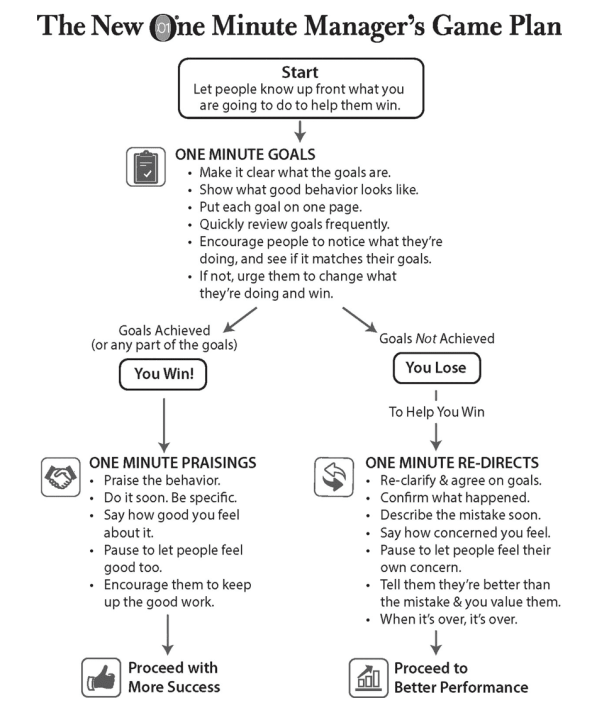

Hello, yesterday I got my hands on one of the bestselling books - "The New One Minute Manager".

In this post I am sharing a summary of "The New One Minute Manager" and what are the key takeaways that can be helpful to become a better engineer or person.
It is a 106 page book written by Ken Blanchard and Spencer Johnson, first published in 1983. And honestly, reading it was really insightful.

# Summary

The book starts with a story of a young man who has been looking all over the world to find a great manager and learn from.
In many organizations, he found two kind of managers, one that are "tough" whose organizations seem to win while the people working there lost and the later "nice" whose people seemed to win while their organizations lost.
He finally finds a great manager, who is known as the "The New One Minute Manager".

The book outlines three secrets shared by "The New One Minute Manager" that will help the people / team find job satisfaction, make meaningful contributions, and feel engaged, and appreciated.

## The First Secret: One Minute Goals

Problems:

- People in team with lack of clearly defined goals and responsibilities.
- Manager doing Micro-Management.

#### How does "The New One Minute Manager" solve it?

Instead of setting goals for the individual team member, "The New One Minute Manager" listens to the input and work side-by-side with people to create goals, keeping [80/20 principle](https://www.investopedia.com/terms/1/80-20-rule.asp) in mind. After both of them agree on important goals, each goal is described in a short paragraph with the due date. The goal should be so specific that it can be reviewed within a minute or less.
The responsibility of a team member is to perform the tasks as per the goals and take a moment now and then to look at what he/she is doing and if it matches the goals.

So, in a way people are managing themselves.

After setting the one-minute goals, "The New One Minute Manager" spends a good amount of time with him/her and has a close supervision in the beginning on how he/she is doing. The reason for close supervision is not to pick on their mistakes, but to catch them doing something right.

## The Second Secret: One Minute Praisings

Problem:

- How to groom people with constructive positive feedback which is sincere and not fake?

#### How does "The New One Minute Manager" solve it?

In a nutshell, "The New One Minute Manager" helps people reach their full potential by catching them doing something right.

In the first half-minute

- Praise people as soon as possible by letting people know what they did right - be specific.
- Tell people how good you feel and how it helps to grow him/her and organization.

Take a Pause for few seconds

- Allow people to feel good about what they have done good.

Then, in the second half-minute

- Encourage them to do more than the same.
- Make it clear you have confidence and support their success.

Coming back to the second part of the problem, how can you make sure it is sincere and not fake?

In the book the author explains by giving an example of parents helping children learn to walk for the first time.
Imagine standing a child up and saying 'Walk,' and when he falls down you pick him up and spank him and say, "I told you to walk"?
Instead, you stand the child up and the first day he wobbles a little, and you get all excited and say "He stood, he stood!". Next day he stands for a moment and maybe wobbles a step, and you are all over him. Finally, the child, realizing that this is a pretty good deal, stands on his legs and more until he eventually walks.

So, the key in the beginning is catching them doing something approximately right until they eventually learn to do it right.
And rather than punishing inexperienced people who are still learning, we need to reset their "one-minute goals understanding" which leads to the third secret.

## The Third Secret: One Minute Re-Direct

Problem:

- What should a manager do when people do something wrong or make a mistake?

Re-direct here means resetting people one-minute goals understanding, make them realize the exact mistake they made, remind him/her responsibilities and at last remind them that you have
confidence and trust in them, and you support their success.

#### How does "The New One Minute Manager" solves it ?

In the first one-minute

- Re-direct people as soon as possible.
- Confirm the facts first, and then review the mistakes together.
- Express how you feel and its impact on results.

Take a few minutes pause

- Allow people to feel concerned about what they have done.

Then, in the second half

- Let them know that they are better than their mistakes.
- Remind them that you have confidence and trust in them, and you support their success.

"One Minute Re-Direct" is intended to help people learn. However, when a person has learned something and shown they can do it, but they have a won't do attitude, the manager has to look at the cost of organization, and whether he/she can afford to keep such a person.

## The New One Minute Manager Game Plan

## Key Takeaways

- All the one-minute secrets help managers to become "facilitate" managers i.e the managers who make the lives of people easier and help the organization to grow.
- Being a manager is not about his/her behavior with people, but it is about managing people's behavior.
- Punishment doesn't work when you use it with someone who's learning. A Re-Direct works.
